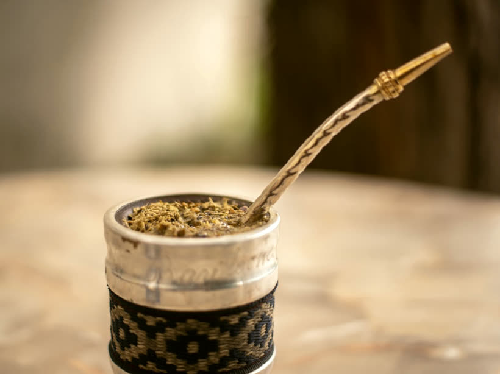

# Mates, Aromas y Bla Bla Bla — sitio web

Landing estática (HTML + CSS + JS, sin build) para la distribuidora mayorista y
minorista de Bahía Blanca.

- **Live:** https://mates-aromas-web.vercel.app/
- **Repo:** https://github.com/fernanditoariel/mates-aromas-web
- **Vercel:** proyecto `mates-aromas-web` (team `coachfernando`), auto-deploy en cada push a `main`.

## Ver en local

```bash
python3 -m http.server 5179
# abrir http://localhost:5179
```

## Estructura

```
index.html                  todo el contenido
assets/css/styles.css        estilos (versión ?v=N en el <link> del HTML)
assets/js/main.js            reveal al scroll, menú mobile, video del local
assets/img/                  logo, favicon, og-cover, poster del video
assets/video/                reel del local (web + original)
vercel.json                  headers de caché (img/video = immutable; css/js/html = revalidate)
```

## Datos del negocio (fuente de verdad)

| Dato | Valor |
|---|---|
| WhatsApp | +54 291 645 2818 · link con texto precargado `Hola vi tu web, quiero info de: ` |
| Email | matesaromasyblablabla@gmail.com |
| Dirección | Fragata Sarmiento 2, 3659 · Bahía Blanca, Buenos Aires (B8000) |
| Horario | Lun a vie 9 a 18 h · Sáb 9 a 13 h |
| Instagram | https://www.instagram.com/matesaromasyblablabla/ |
| Facebook | https://www.facebook.com/matesaromasyblablabla/ |

## Pendiente: fotos reales de producto

La sección **Qué vendemos** tiene 12 tarjetas. Hoy cada una muestra una **foto de
stock gratis (Unsplash)** en `assets/img/prod-<rubro>.jpg`, con un ajuste cálido
parejo por CSS para que el set se vea coherente. **Son provisorias**: cuando Ali
mande fotos reales de sus productos, reemplazar el archivo con el mismo nombre
(JPG, ~820×615 px, 4:3) y listo — el `<i>` que queda detrás es solo un fallback.

```html
<div class="cat__media">
  
  <i class="ph-fill ph-coffee" aria-hidden="true"></i>
</div>
```

Qué conviene que muestre cada foto real cuando lleguen (JPG, ~820×615, 4:3):

| Tarjeta | Archivo | Qué mostrar |
|---|---|---|
| Mates | `prod-mates.jpg` | varios mates juntos (calabaza, madera, acero) |
| Cuchillos | `prod-cuchillos.jpg` | cuchillos con vaina de cuero |
| Aromatizadores | `prod-aromatizadores.jpg` | difusores / aromatizadores de ambiente |
| Kit mate | `prod-kit-mate.jpg` | set mate + termo + bombilla en su caja |
| Lámparas de sal | `prod-lamparas-sal.jpg` | lámpara de sal encendida |
| Tazas | `prod-tazas.jpg` | tazas / jarros con diseños |
| Regalos | `prod-regalos.jpg` | armado de regalo / caja |
| Artesanías | `prod-artesanias.jpg` | piezas de cuero / madera / cerámica |
| Termos | `prod-termos.jpg` | termos de varias marcas |
| Marroquinería | `prod-marroquineria.jpg` | carteras / mochilas |
| Sahumerios | `prod-sahumerios.jpg` | sahumerios y portasahumerios |
| Atrapasueños | `prod-atrapasuenos.jpg` | atrapasueños colgados |

Las fotos del feed de Instagram sirven perfecto. Al reemplazar, subir el número de
versión de `styles.css?v=N` en `index.html` no hace falta (las imágenes tienen
nombre nuevo), pero si se toca el CSS/JS sí.
